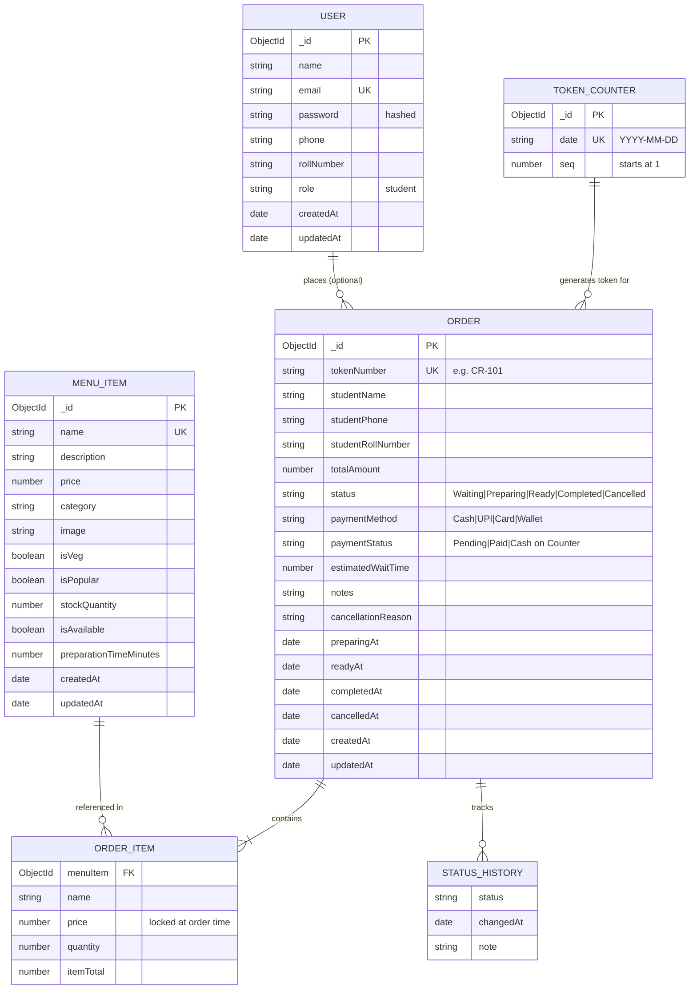
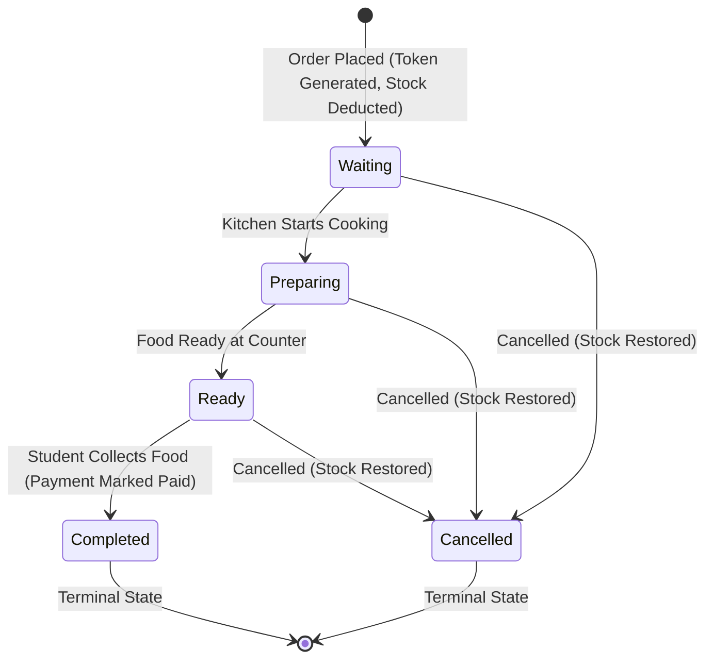
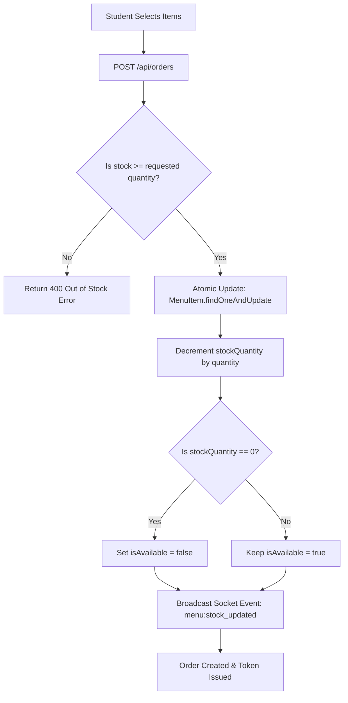

# 🗄️ Database Schema Documentation — Canteen Rush Manager

Complete database design, MongoDB collections, entity relationships, validation rules, indexes, and lifecycle state machines for the **Canteen Rush Manager** system.

---

## 📊 Entity Relationship Diagram (ERD)



---

## 📑 Collections & Schemas

### 1. `users` Collection
Stores registered student accounts. Staff/Admin authentication is managed via server environment configuration without database storage.

| Field Name | Type | Required | Unique | Default | Description & Validation |
| :--- | :--- | :---: | :---: | :---: | :--- |
| `_id` | `ObjectId` | Auto | Yes | Auto | MongoDB primary key |
| `name` | `String` | **Yes** | No | — | Student full name (trimmed) |
| `email` | `String` | **Yes** | **Yes** | — | Unique lowercase student email |
| `password` | `String` | **Yes** | No | — | Bcrypt hashed password (`min: 6 chars`, hidden by default) |
| `phone` | `String` | No | No | `""` | Optional contact number |
| `rollNumber` | `String` | No | No | `""` | College roll number (e.g., `CS-2024-042`) |
| `role` | `String` | No | No | `"student"` | User role (`enum: ['student']`) |
| `createdAt` | `Date` | Auto | No | `Date.now` | Registration timestamp |
| `updatedAt` | `Date` | Auto | No | `Date.now` | Last update timestamp |

**Indexes:**
- `{ email: 1 }` (Unique)

---

### 2. `menuitems` Collection
Stores all food and beverage items available in the canteen, along with pricing, real-time stock levels, and category classification.

| Field Name | Type | Required | Unique | Default | Description & Validation |
| :--- | :--- | :---: | :---: | :---: | :--- |
| `_id` | `ObjectId` | Auto | Yes | Auto | MongoDB primary key |
| `name` | `String` | **Yes** | **Yes** | — | Food item name (trimmed) |
| `description` | `String` | No | No | `""` | Item ingredients / description |
| `price` | `Number` | **Yes** | No | — | Price in INR (`min: 1`) |
| `category` | `String` | **Yes** | No | `"Snacks"` | `enum: ['Snacks', 'Meals', 'Beverages', 'Fast Food', 'South Indian', 'Desserts', 'Other']` |
| `image` | `String` | No | No | Default URL | Image URL |
| `isVeg` | `Boolean` | No | No | `true` | Vegetarian flag |
| `isPopular` | `Boolean` | No | No | `false` | Highlighted as popular/bestseller |
| `stockQuantity` | `Number` | No | No | `50` | Real-time physical inventory (`min: 0`) |
| `isAvailable` | `Boolean` | No | No | `true` | Derived availability flag (`false` when `stockQuantity == 0`) |
| `preparationTimeMinutes`| `Number` | No | No | `5` | Average kitchen prep time in minutes (`min: 1`) |
| `createdAt` | `Date` | Auto | No | `Date.now` | Creation timestamp |
| `updatedAt` | `Date` | Auto | No | `Date.now` | Last update timestamp |

**Indexes:**
- `{ name: "text" }` (Full text search on name)
- `{ category: 1, isAvailable: -1 }` (Category filtering)
- `{ isAvailable: -1, isPopular: -1 }` (Student menu sorting)

---

### 3. `orders` Collection
Tracks the full lifecycle of an order from student placement to kitchen preparation and pickup.

| Field Name | Type | Required | Unique | Default | Description & Validation |
| :--- | :--- | :---: | :---: | :---: | :--- |
| `_id` | `ObjectId` | Auto | Yes | Auto | MongoDB primary key |
| `tokenNumber` | `String` | **Yes** | **Yes** | — | Daily unique token (e.g. `CR-101`, `CR-102`) |
| `studentName` | `String` | **Yes** | No | — | Name of student ordering (trimmed) |
| `studentPhone` | `String` | No | No | `""` | Student phone number |
| `studentRollNumber`| `String` | No | No | `""` | Student roll number |
| `items` | `[OrderItem]` | **Yes** | No | — | Array of ordered items (`min: 1 item`) |
| `totalAmount` | `Number` | **Yes** | No | — | Total bill in INR (`min: 0`) |
| `status` | `String` | No | No | `"Waiting"` | `enum: ['Waiting', 'Preparing', 'Ready', 'Completed', 'Cancelled']` |
| `statusHistory` | `[StatusHistory]`| No | No | `[]` | Audit trail of all state transitions with timestamps |
| `paymentMethod` | `String` | No | No | `"Cash"` | `enum: ['Cash', 'UPI', 'Card', 'Wallet']` |
| `paymentStatus` | `String` | No | No | `"Cash on Counter"`| `enum: ['Pending', 'Paid', 'Cash on Counter']` |
| `estimatedWaitTime`| `Number` | No | No | `10` | Kitchen estimated wait time in minutes |
| `notes` | `String` | No | No | `""` | Special preparation instructions |
| `cancellationReason`| `String`| No | No | `""` | Reason if order is cancelled |
| `preparingAt` | `Date` | No | No | `null` | Timestamp when kitchen started cooking |
| `readyAt` | `Date` | No | No | `null` | Timestamp when food is ready for counter pickup |
| `completedAt` | `Date` | No | No | `null` | Timestamp when student collected food |
| `cancelledAt` | `Date` | No | No | `null` | Timestamp if order was cancelled |
| `createdAt` | `Date` | Auto | No | `Date.now` | Order placement timestamp |
| `updatedAt` | `Date` | Auto | No | `Date.now` | Last update timestamp |

#### Embedded Sub-Schema: `OrderItem`
```json
{
  "menuItem": "ObjectId (ref: MenuItem)",
  "name": "String",
  "price": "Number (price locked at time of order)",
  "quantity": "Number (min: 1)",
  "itemTotal": "Number (price * quantity)"
}
```

#### Embedded Sub-Schema: `StatusHistory`
```json
{
  "status": "String (Waiting | Preparing | Ready | Completed | Cancelled)",
  "changedAt": "Date",
  "note": "String"
}
```

**Indexes:**
- `{ tokenNumber: 1 }` (Unique lookup for student tracking)
- `{ status: 1, createdAt: 1 }` (Kitchen staff active queue sorting)

---

### 4. `tokencounter` Collection
Maintains an atomic counter for each calendar day to generate consecutive token numbers (`CR-101`, `CR-102`, ...) safely during concurrent rush-hour orders.

| Field Name | Type | Required | Unique | Default | Description |
| :--- | :--- | :---: | :---: | :---: | :--- |
| `_id` | `ObjectId` | Auto | Yes | Auto | MongoDB primary key |
| `date` | `String` | **Yes** | **Yes** | — | Format: `YYYY-MM-DD` (UTC) |
| `seq` | `Number` | No | No | `0` | Atomic increment counter |

---

## 🔄 Order Lifecycle State Machine



### Transition Validation Rules:
| Current Status | Allowed Next Statuses | Action on Transition |
| :--- | :--- | :--- |
| **`Waiting`** | `Preparing`, `Cancelled` | Set `preparingAt = now` OR restore stock & set `cancelledAt = now` |
| **`Preparing`** | `Ready`, `Cancelled` | Set `readyAt = now` (Triggers counter bell/display) |
| **`Ready`** | `Completed`, `Cancelled` | Set `completedAt = now`, mark `paymentStatus = "Paid"` |
| **`Completed`** | *(None — Terminal)* | Immutable state |
| **`Cancelled`** | *(None — Terminal)* | Immutable state |

---

## 📦 Stock Synchronization Architecture


